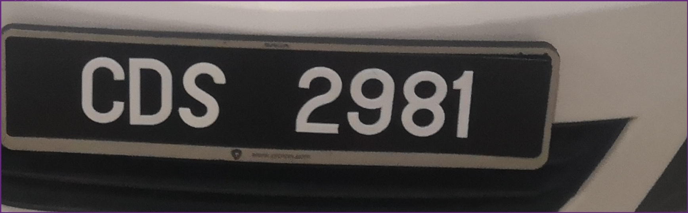

# FYP License Plate Recognition using CNN Network YOLOv5
This is my Final Year Project to develop a system to detect and recognize license plate of vehicles. This project use the Aritificial Intelligence (AI) technique suah as Convolutional Neural Network (CNN) and Image Processing.

## Requirements
Python 3.8 or later with all [requirements.txt](https://github.com/Wenxiang98/FYP_License-Plate_Recognition_YOLOv5/blob/main/requirements.txt) dependencies installed,including `torch>=1.7`. To install run:
```bash
$ pip install -r requirements.txt
```

## Environments
I run the YOLOv5 training model in the Google Colab notebooks with free GPU <a href="https://colab.research.google.com/github/ultralytics/yolov5/blob/master/tutorial.ipynb"></a> with all the dependecies such as [Python](https://www.python.org/) and [PyTorch](https://pytorch.org/) is preinstalled.  

## Inference
After getting the model from the CNN Network YOLOv5, `detect.py` runs inference on a variety of sources.

```bash
$ python detect.py --source 
```
To run the inference on images: 
```bash
YOLOv5  2021-6-4 torch 1.8.1+cpu CPU

Fusing layers...
Model Summary: 224 layers, 7266973 parameters, 0 gradients
data/images
Results saved to runs\detect\exp2
Done. (1.589s)
```
 
